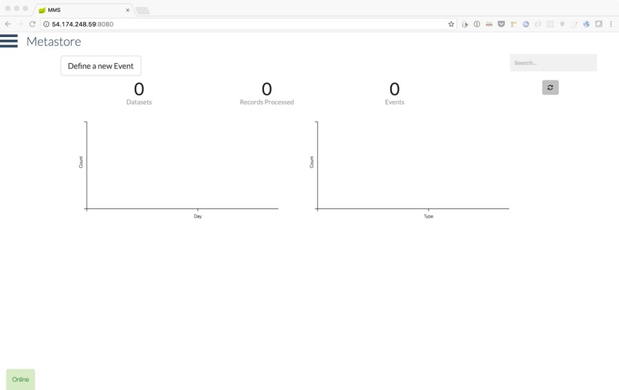
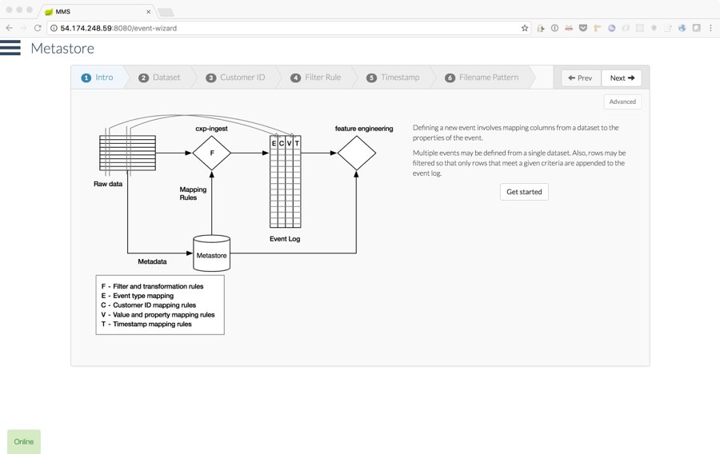
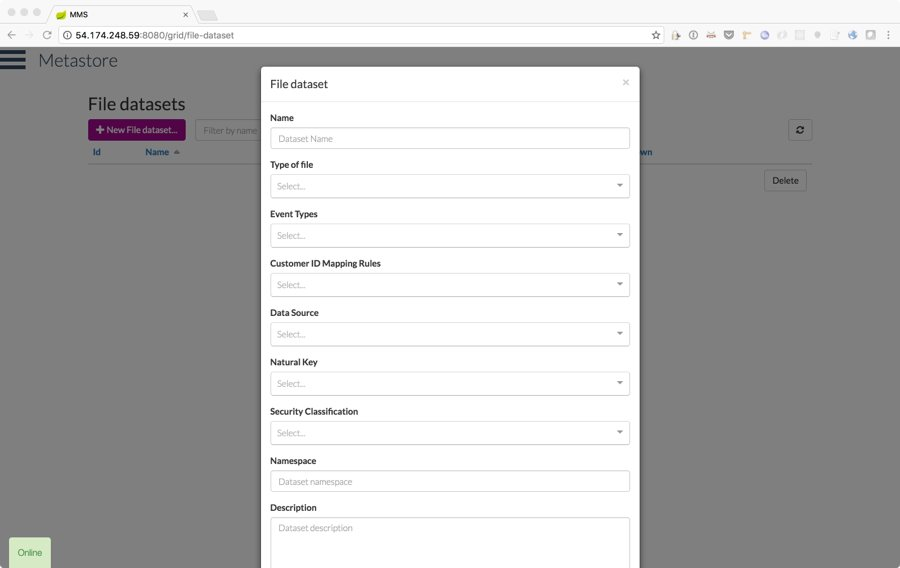
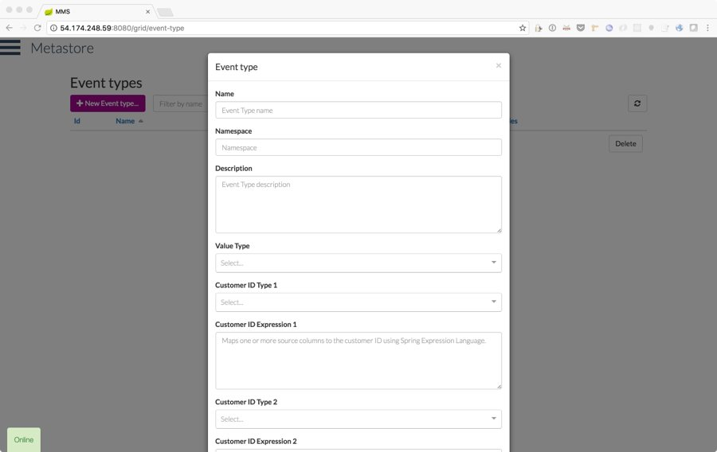
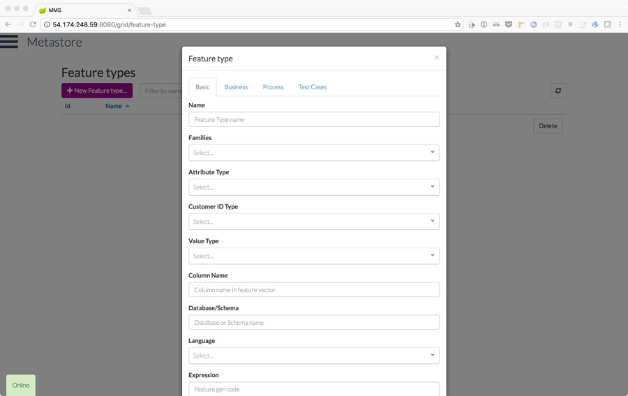
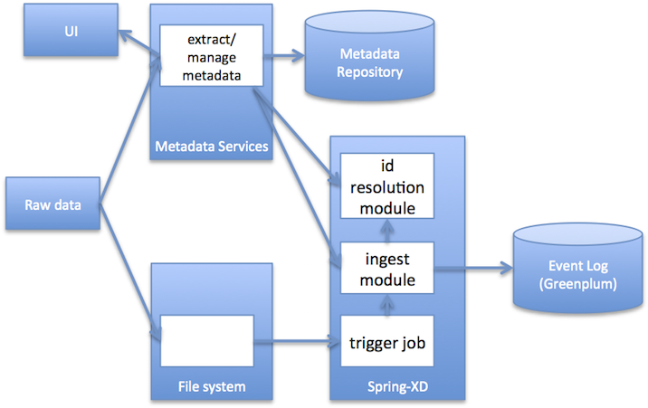

# Metastore and dependencies

Click here to see [demo](http://54.174.248.59:8080/).

* metastore - metadata respository. one of its functions is to drive ingest into the event log.
* cxp-ingest - Spring Batch module to ingest a delimited file into the event log using metadata from the metastore. custom column and row delimiters may be used. (depends on cxp-transform, cxp-batch-io)
* cxp-json-ingest - Spring Batch module to ingest a JSON file into the event log using metadata from the metastore. (depends on cxp-transform, cxp-batch-io)
* cxp-hdfs-ingest - Spring Batch module to ingest a file or directory on HDFS into the event log using metadata from the metastore. (depends on cxp-transform, cxp-batch-io)
* cxp-batch-io - common Spring Batch writers and helper classes.
* cxp-file-splitter - Spring XD custom source module that splits a file into a line stream. (introduced as an out-of-the-box module in Spring XD 1.2.0)
* cxp-ingest-stream - Spring XD custom processor module that transforms a line into one or more customer events, as a stream. (depends on cxp-transform)
* cxp-metadata-provider - Library that looks up metadata from the the Metastore for a given filename. also responsible for writing job information and errors to the Metastore database.
* cxp-transform - Library that transforms a JSON document or map of key-value pairs representing a data record into one or more customer events. this module uses expressions/rules from the Metastore to perform the transformation. (depends cxp-metadata-provider)
* filere - custom extension of Spring XD file source module to accept a regex pattern instead of an Ant-style file path pattern to match files when polling. a regex pattern enables both inclusion and exclusion rules to be specified, e.g. 'include all file that start with ..., but exclude any files that end with ...'.
* id-mapping-ingest (untested) - Spring Batch modeule to ingest customer-id mapping ``
* web-analysis - sample code using Spark to ingest omniture data into an event log, generate features from the log using Spark and SparkR, and pivot into feature vectors that can be queried using HAWQ.

## Building Projects

### Artifactory

Building the projects depends on Artifactory.

The following repositories have been setup on Artifactory:

#### Local Repositories

* ext-release-local - maven-2-default layout, 'Includes Pattern' = \*\*/\*, 'Handle Releases' checked, 'Maven Snapshot Version Behaviour' = Unique
* ext-snapshot-local - maven-2-default layout, 'Includes Pattern' = \*\*/\*, 'Handle Snapshots' checked, 'Maven Snapshot Version Behaviour' = Unique
* libs-release-local - maven-2-default layout, 'Includes Pattern' = \*\*/\*, 'Handle Releases' checked, 'Maven Snapshot Version Behaviour' = Unique
* libs-snapshot-local - maven-2-default layout, 'Includes Pattern' = \*\*/\*, 'Handle Snapshots' checked, 'Maven Snapshot Version Behaviour' = Unique
* plugins-release-local - maven-2-default layout, 'Includes Pattern' = \*\*/\*, 'Handle Releases' checked, 'Maven Snapshot Version Behaviour' = Unique
* plugins-snapshot-local - maven-2-default layout, 'Includes Pattern' = \*\*/\*, 'Handle Snapshots' checked, 'Maven Snapshot Version Behaviour' = Unique

#### Remote Repositories

* conjars.org - url = http://conjars.org/repo, 'Handle Releases' checked, 'Handle Snapshots' checked
* jcenter - Bintray Central Java repository, url = http://jcenter.bintray.com, 'Handle Releases' checked
* repository.jboss.org - url = http://repository.jboss.org/nexus/content/groups/public/, 'Handle Releases' checked, 'Handle Snapshots' checked
* spring-milestone - url = http://repo.spring.io/milestone, 'Handle Releases' checked, 'Handle Snapshots' checked
* spring-plugins-release - url = http://repo.spring.io/plugins-release, 'Handle Releases' checked
* spring-plugins-snapshot - url = http://repo.spring.io/plugins-snapshot, 'Handle Snapshots' checked
* spring-release - url = http://repo.spring.io/release, 'Handle Releases' checked
* spring-snapshot - url = http://repo.spring.io/snapshot, 'Handle Snapshots' checked

#### Virtual Repositories

* libs-release - selected repos: libs-release-local, ext-release-local, remote-repos
* libs-snapshot - selected repos: libs-snapshot-local, ext-snapshot-local, remote-repos
* plugins-release - selected repos: plugins-release-local, ext-release-local, remote-repos
* plugins-snapshot - selected repos: plugins-snapshot-local, ext-snapshot-local, remote-repos
* remote-repos - selected repos: jcenter, spring-plugins-snapshot, spring-plugins-release, spring-release, spring-milestone, spring-snapshot, repository.jboss.org, conjars.org

### Setting up the Database

The Metastore database uses Postgresql. (In fact, any JDBC database can be used.)

There are two schemas, which can live on separate and different database instances.

The 'meta' schema contains metadata.

The 'cxp' schema can store the actual events, and those table that need to live with the events, such as 'event_types'.

In release 1.0, the 'meta' schema was located on Postgresql as it needed to handle transactions. Whereas, the 'cxp' schema was located on Greenplum.

JDBC configuration is maintained in 'src/main/environments', under the relevant environment - local, dev, and prod.

The database for a Postgresql implementation of both schemas, including population of required reference tables, can be restored from 'database/cxpdev.sql'. The database name is 'cxpdev'. Also, in my environment, I setup Postgresql on port 5433, since Greenplum was using port 5432. The default configuration in the code reflects these port choices. The following restore command will recreate the database, assuming any database of the same name has been dropped.

    pg_restore -p 5433 -C -d cxpdev database/cxpdev.sql

### Building Projects

Projects use the Gradle build tool.

For projects that have environment-specific configuration, the environment can be set in the build command. (The default environment is 'dev'.)

    ./gradlew clean -Penv=local build

If a project dependency has been updated, the build command may need to force refreshing dependencies.

    ./gradlew clean -Penv=local build --refresh-dependencies

Some projects, such as this, depend on artifacts from other metamorphic projects, which are not in a public repo. These projects must be published to Artifactory, so they can be resolved in dependent projects. To publish a project to Artifactory, use the following command:

    ./gradlew artifactoryPublish
